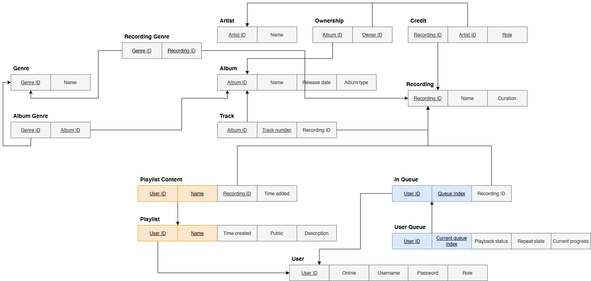
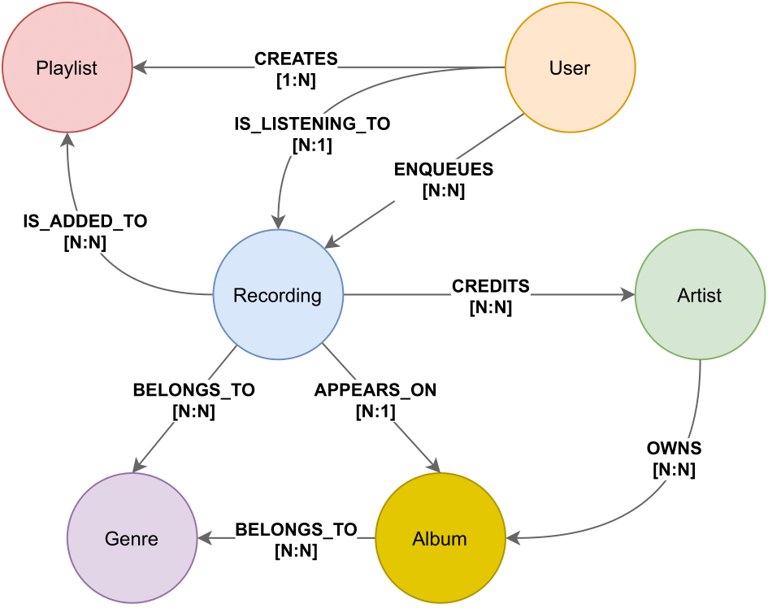
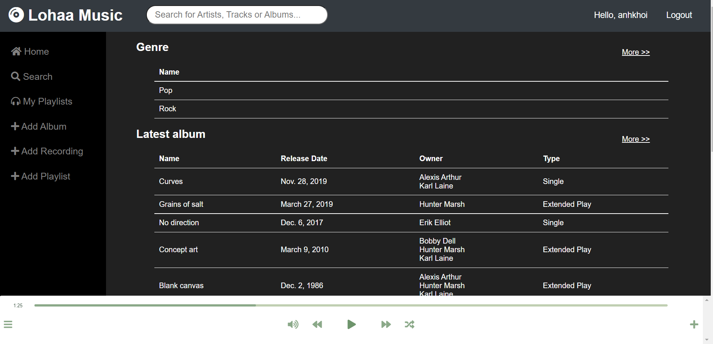
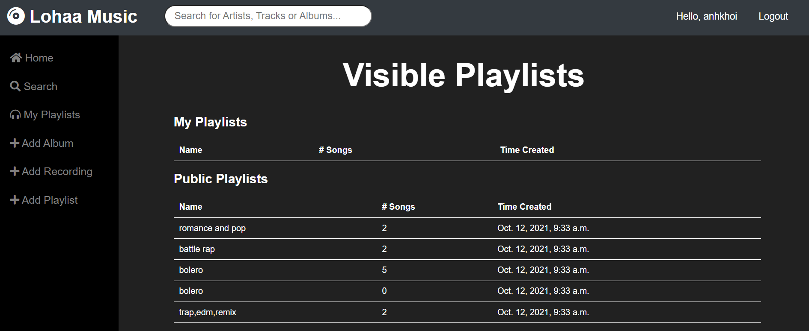
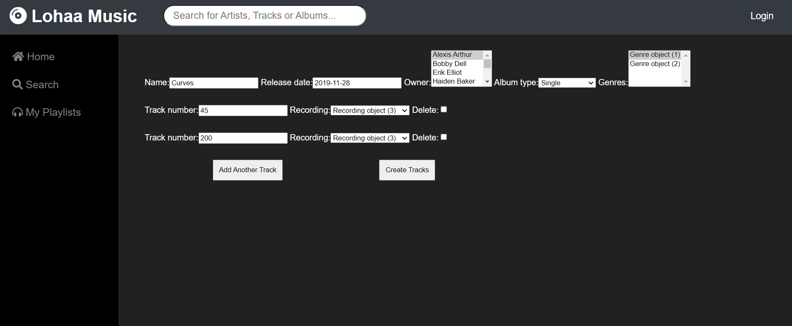
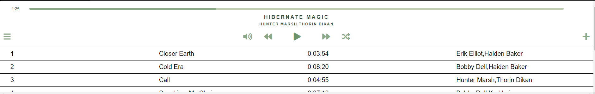
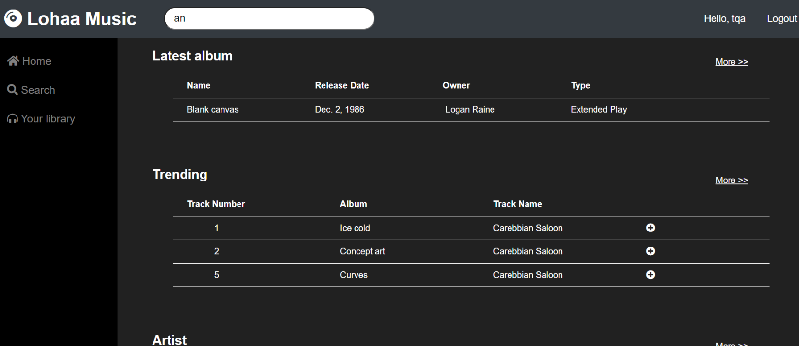
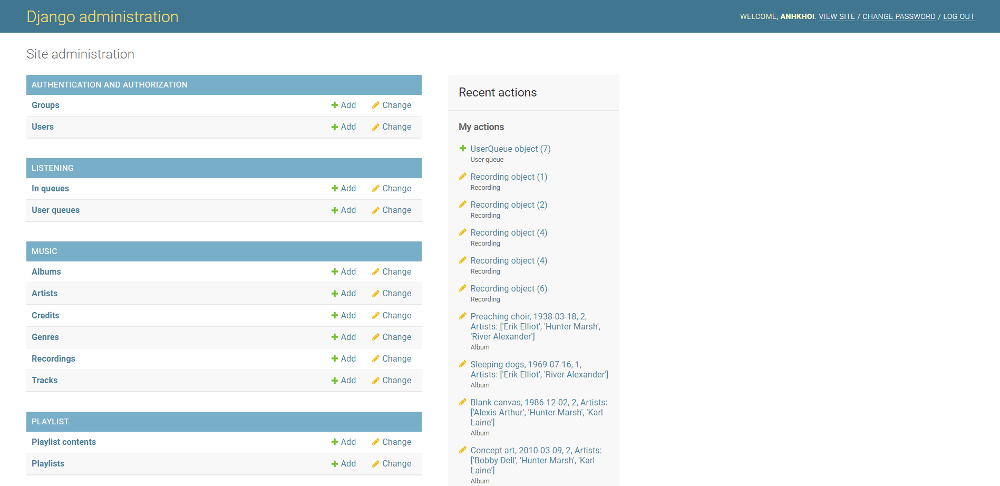

# Music Streaming Service

    

**Description:**

This project impement a simple web application of a music streaming service to illustrate the DBMS implementation process.

We designed an intricate database structure and simulate it by two different DBMS:

1. SQLite
2. Neo4j

Detailed report is available [here](https://www.overleaf.com/read/xkkgyrmvbnfz)

## General Information

- Two user roles are admin and listener (normal user)
- User can browse:
    1. Songs
    2. Artist
    3. Album
    4. Playlist
- Queueing features:
    1. Create playlist
    2. Add track to playlist
    3. Play a track
- Account features: change account information
- Admin manages the whole database and add users to the database

## Database Design

1. Relational DB Design (SQLite)

   

2. Graph DB Design (Neo4j)

    

## Technologies Used

- Neo4j
- SQLite
- HTML, CSS
- Django (Python)
- JS

## Screenshots

1. Homepage

    
2. Show user's playlists

    
3. Artist detail page

    
4. Adding a track to album

    
5. Listening Queue

    
6. Search feature

    
7. Admin page

    

## Future Improvements

- Better UI
- Clean Up CSS and HTML
- Revise DBMS designs

## Acknowledgements

- This project was inspired by [Spotify](https://www.spotify.com/)
